# Informe de la Resolución del Proyecto

_M2 Blocks - Lógica para Cs. de la Computación - 2025_

**Comisión `[57]`**:

- `[Laime David]`
- `[Poza Agustin]`
- `[Saucedo Marcos]`

## En este informe explicamos las estrategias seguidas para implementar la lógica del juego estilo M2BLOCKS con disparo de bloques y gravedad hacia arriba, utilizando Prolog para el backend y React para el frontend. Se explican las soluciones a los requerimientos funcionales, los desafíos encontrados y las pruebas realizadas.

📌 Generación aleatoria del bloque a disparar.
Para determinar el valor del bloque a disparar, se utilizo una tabla fija que especifica el rango permitido en función del bloque máximo que se presenta en la grilla. Esta tabla fue implementada en el predicado range_for_max/3 siguiendo exactamente los valores establecidos en el enunciado hasta el bloque 16384.
Tabla establecida:

        | **Máximo de la Grilla** | **Rango**       | **Observación**          |
        |-------------------------|-----------------|--------------------------|
        | 2, 4, 8                 | 2 a 4           |                          |
        | 16                      | 2 a 8           |                          |
        | 32                      | 2 a 16          |                          |
        | 64                      | 2 a 32          |                          |
        | 128, 256, 512           | 2 a 64          |                          |
        | 1024                    | 4 a 128         | Se retira el 2           |
        | 2048                    | 8 a 256         | Se retira el 4           |
        | 4096, 8192              | 16 a 512        | Se retira el 8           |
        | 16k                     | 32 a 1024       | Se retira el 16          |

Como el enunciado solo esta establecido hasta el valor 16K y no se especifica que ocurre al superar dicho valor, adoptamos una convencion general para poder resolver los demas casos:
-Si el nuevo bloque máximo alcanzado en la grilla es 2^n y n > 14 (Osea que supero el valor de 16k)
-El rango valido para el proximo bloque a disparar se define como: Rango permitido = [2^n-9, 2^n-4]
Esta formula genera automaticamente un rango acotado de potencias de dos. Por ejemplo la tabla para los siguientes valores quedaria asi:

        | **Máximo de la Grilla** | **Rango**       | **Observación**          |
        |-------------------------|-----------------|--------------------------|
        | 32768 (2¹⁵)             | 64 a 2048       |Se retira el 32           |
        | 65536 (2¹⁶)             | 128 a 4096      |Se retira el 64           |
        | 131072 (2¹⁷)            | 256 a 8192      |Se retira el 128          |
        | …                       | …               | …                        |

En caso de tener la grilla vacia la consulta randomBlock(Grid, Block) a prolog nos deberia devolver 2 o 4, en este caso agregamos opciones_validas(0, [2, 4]) :- !. ya que si no la consulta inicial "init(Grid, NumOfColumns), randomBlock(Grid, Block1), randomBlock(Grid, Block2)" nos devolvia falso y no nos dejaba obtener la grilla inicial.

📌 Efecto del disparo de un bloque.
El disparo comienza cuando relizamos un click sobre una columna, desde game le enviamos una query a prolog con la forma:
shoot(${shootBlock}, ${lane}, ${gridS}, ${numOfColumns}, Effects), last(Effects, effect(RGrid,\_)), randomBlock(RGrid, Block)`
Shoot: Se intenta colocar el bloque (ShootBlock) en la columna (Lane) y se aplican los efectos de gravedad hasta que se encuentre con un tope. Luego, se fusionan los bloques de la grilla y se aplica nuevamente la gravedad hasta que no haya más cambios. Finalmente, se verifica si debe limpiarse algún bloque retirado debido a un cambio de rango. Cada paso genera un effect que se acumula en la lista Effects.

Gravity: Se evalúa cada celda de la grilla; si hay una celda vacía ('-') sobre el bloque, este se mueve hacia arriba.

Fusion: Se detectan grupos conectados de bloques con el mismo valor y se fusionan en un solo bloque, utilizando la fórmula:
valor_fusionado = valor_original \* 2^(N−1), donde N es el tamaño del grupo. El bloque resultante se posiciona hacia arriba o hacia la izquierda, según la disposición.

Animaciones: Se procesan los effects, actualizando la grilla cada 50 milisegundos en función de los estados.

📌 Avisos “Combo x N”.
Para mostrar la cantidad de combos generados en la jugada actual, dentro de Game.tsx utilizamos funcion en la que procesamos Effects, contabilizamos cuántas veces prolog devuelve un newBlock, luego si la cantidad de nuevos bloques que se produjeron es mayor que 1 seteamos el contador de combos con la cantidad de nuevos bloques, luego mostraremos un mensaje con esa cantidad de combos que durara 2 segundos.

📌 Avisos de nuevo bloque máximo logrado.
Durante el procesamiento de los efectos, se verifica si alguno de los nuevos bloques generados supera el valor actual de maxBlock (solo si es mayor a 512). Si es así, se actualiza el bloque máximo y se muestra una notificación al usuario.
Adicionalmente, si se detecta un range_changed, significa que el rango permitido fue modificado. Esto implica que se establecerá un nuevo mínimo y máximo para los bloques a disparar y se eliminará de la grilla el valor mínimo anterior.
Este cambio se refleja en el efecto con la forma: "removed(MinInicial), range_changed(MinFinal, MaxRFinal)", luego mostraremos un mensaje con el nuevo bloque maximo (MaxRFinal), el nuevo bloque minimo (MinFinal). A su vez tambien notificaremos cuales son los bloques que eliminamos (MinInicial).

📌 Limpieza de bloques retirados.
Para implementar la funcionalidad de limpieza de bloques, se compararon los rangos permitidos antes y despues de una jugada. Esto se hace obteniendo eñ valor maximo de la grilla antes y despues del disparo, y consultando los rangos correspondientes mediante el predicado range_for_max/3.
Si el minimo del rango cambio, significa que el bloque correspondiente fue retirado, por lo que se debe de eliminar de la grilla. Para esto, se recorre toda la grilla reemplazando las apariciones de ese valor por celdas vacias('-'), y luego se aplica nuevamente la gravedad para que los bloques suban y ocupen los huecos.

Desafios encontrados:
Nos encontramos con 2 problemas al implementar esa solucion.

1. Fusión pendiente luego de la limpieza de bloques retirados

En ciertos escenarios, una jugada que produce una gran fusión (por ejemplo, dos bloques 512 generando un 1024) también provoca un cambio en el rango permitido y la correspondiente limpieza de bloques retirados (como el 2).
Luego de aplicar la limpieza puede ocurrir que queden bloques adyacentes que podrian fusionarse por ejemplo, dos bloques de 16 que ahora estan juntos en una columna. Sin embargo en nuestra implementacion inicial, esas fusiones no se realizaban, si no que requerian que se dispare un nuevo bloque para desencadernarlas.
Para resolver este problema, luego de hacer la limpieza de bloques retirados se vuelve a ejecutar el ciclo completo de fusionar_con_gravedad/4 sobre la grilla final resultante. Esto garantiza que cualquier nueva fusion posible posterior a la limpieza tambien se realice en la misma jugada.

2. El booster “bloque siguiente” puede mostrar un valor fuera del rango.

El problema ocurre cuando el valor generado como "siguiente bloque" pertenece al rango anterior, pero ya no es valido despues de una jugada que cambia el rango por ejemplo: al disparar un bloque que genera un 1024, eliminando el 2 del rango.
En este caso, el sistema puede seguir mostrando un 2 como próximo bloque a disparar, aunque ya no debería generarse. Esto se debe a que el bloque siguiente fue seleccionado antes de aplicar la fusión y actualizar el rango.
Para resolver este problema, se implementó una validación adicional en Game.tsx en function animateEffect. Cuando desde Prolog se recibe el efecto removed/1 (que indica que un valor fue retirado del rango), se verifica si el bloque siguiente que ya estaba preseleccionado coincide con el valor retirado.
Si coincide, se considera inválido, y se realiza inmediatamente una nueva consulta a Prolog (randomBlock/2) pasando la grilla actual, con el fin de regenerar un nuevo bloque válido acorde al nuevo rango. Esto garantiza que el bloque siguiente que se muestra al jugador sea siempre coherente con el estado actualizado del juego.

📌 Booster Hint jugada.
El booster Hint consiste en simular una jugada para la columna actual, es decir, desde prolog simulamos un shoot y obtener los effects de ese shoot en esa grilla, luego en los effects contamos cuantas fusiones se realizaron, la suma de puntos y el maximo valor alcanzado, desde Game obtenemos la respuesta de hint con la forma hint(Column, Block, TotalValue, NumBlocks, MaxValue), y mostraremos un cartel semi transparente sobre cada columna con los valores TotalValue, NumBlocks y MaxValue, de otra forma si no fuese a ocurrir ninguna fusion sobre la columna mostraremos score, combos y max en 0.

📌 Booster Bloque siguiente.
En Game siempre guardaremos 2 boques, ShootBlock el cual contendra el valor del bloque actual que podremos disparar y NextBlock el cual contendra el valor del siguiente bloque a disparar. Cada vez que hagamos click sobre una columna y realicemos un shoot (de ser posible), en la consulta enviada a prolog tambien incluiremos una consulta randomBlock(RGrid, Block), el valor pasado por block lo guardaremos en NextBlock, entonces siempre tendremos guardado el siguiente bloque a disparar.
Podemos obtener el Booster de Bloque Siguiente al presionar el boton Siguiente Bloque. Lo que nos permitira ver el NextBlock durante 3 segundos.
Debemos tener en cuenta que al iniciar el juego debemos pedir un randomBlock adicional.

Casos De Prueba:

1. Grilla Vacia:

   

2. Grilla Normal: En este caso el juego puede funcionar correctamente.
   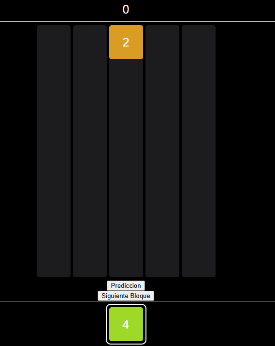 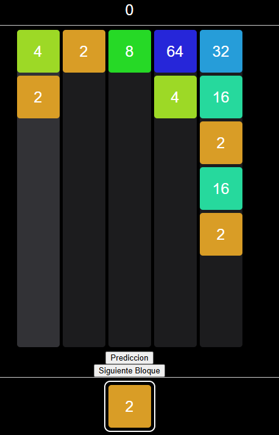

3. Grilla iniciada con valores a fusionar: en este caso fusionara los valores luego del primer shoot
   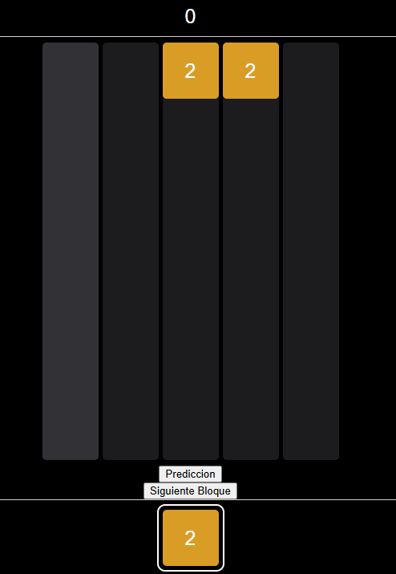 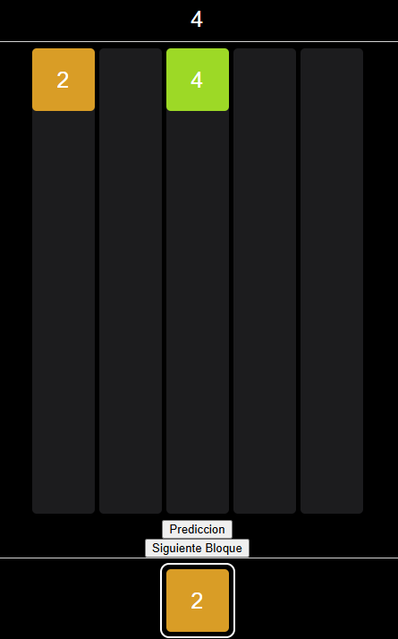

4. Grilla iniciada con valores a fusionar y fusion resultante en bloque a limpiar: en este caso luego del primer shoot fusionara los valores y luego de la fusion mostrara los avisos correspondientes y eliminara los bloques que correspondan, luego de eliminar los bloques hara una ultima fusion para evitar que bloques queden sin fusionar.

   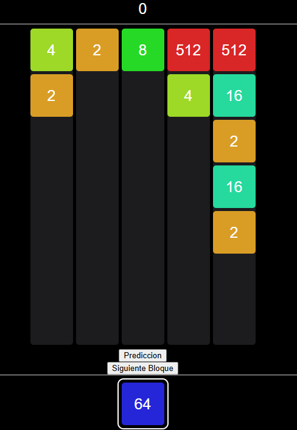 -> 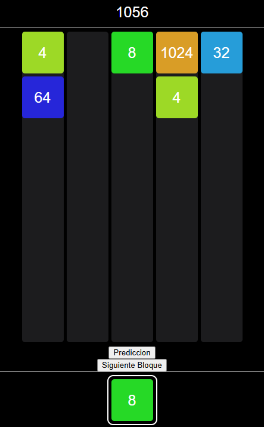

5. Aviso de bloque maximo: luego de combinar 512 mostramos el primer aviso de bloque maximo alcanzado, y en caso de haber disparado un bloque que tenemos que limpiar este debe ser eliminado
   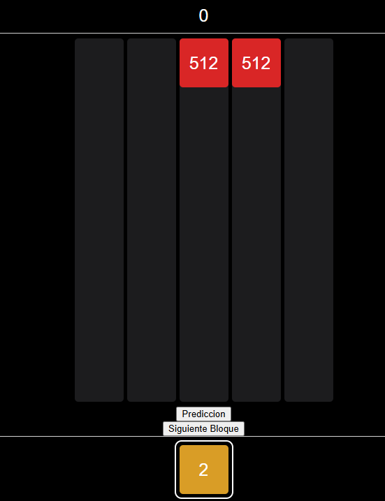 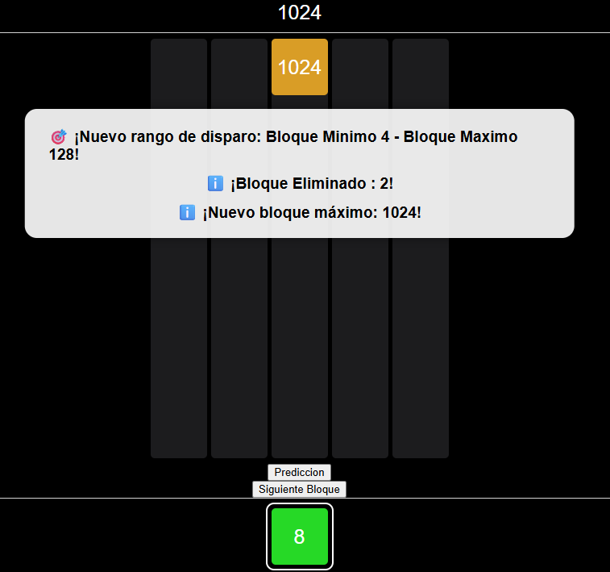

6. Cambio de rango: luego de combinar 512 mostramos el aviso de cambio de rango y en caso de tener un bloque guardado para disparar como siguiente que tenga el valor a limpiar, lo volvemos a recalcular en el rango adecuado.
    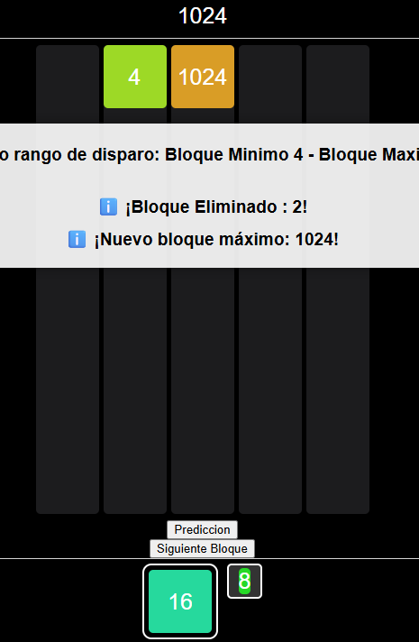

7. Booster Hint: en caso de activar el hint nos mostrara todos los combos que se realizaran en la grilla en consecuencia del disparo.
   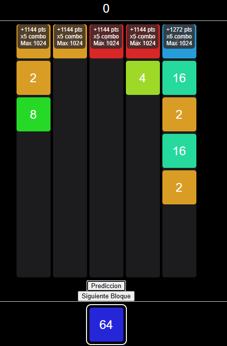 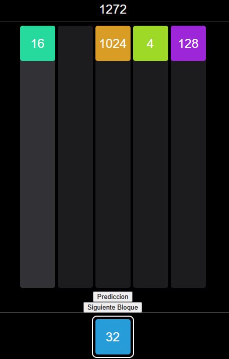

# Conclusion

## Mediante el desarrollo del juego, pudimos adquirir conocimientos sobre nuevas tecnologías como React, CSS, JavaScript, etc. También reconocemos que trabajar con Prolog resultó poco amigable en muchos momentos. Al ser un lenguaje declarativo, con una forma de razonamiento muy distinta a la programación imperativa o funcional, su uso nos resultó desafiante, especialmente al modelar procesos secuenciales. A pesar de eso, resultó muy satisfactorio ver cómo se reflejó lo visto en teoría con la práctica. El juego en sí nos resultó muy entretenido y nos dejó una buena experiencia en general. Durante el desarrollo del proyecto, si bien no hicimos muchas consultas sobre código, sí aprovechamos la posibilidad de preguntar sobre situaciones no del todo especificadas en el enunciado. En esos casos, el ayudante nos ayudó a interpretar correctamente los requerimientos o a tomar decisiones razonables para resolver los casos problemáticos, lo cual nos permitió avanzar con mayor claridad.
